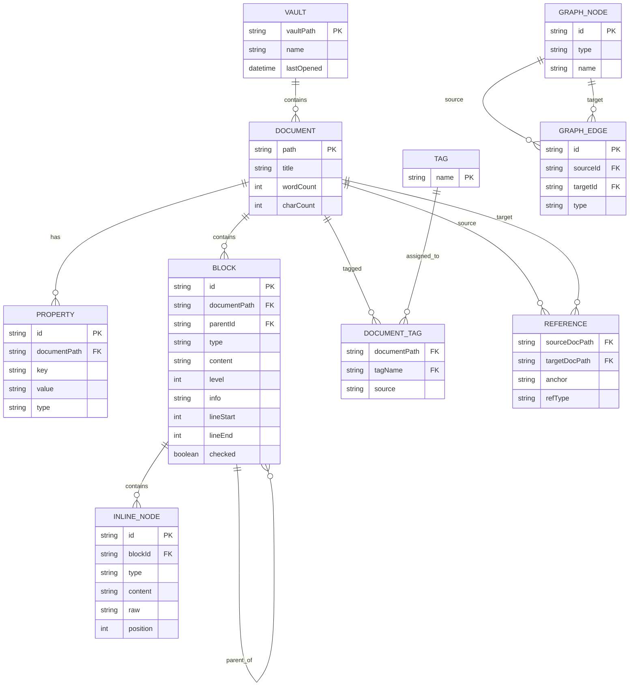
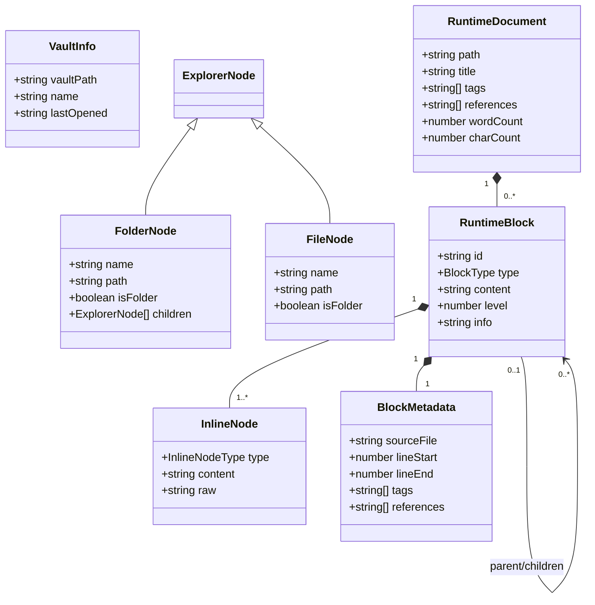
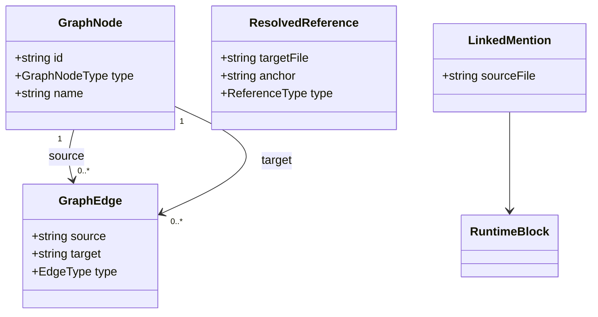
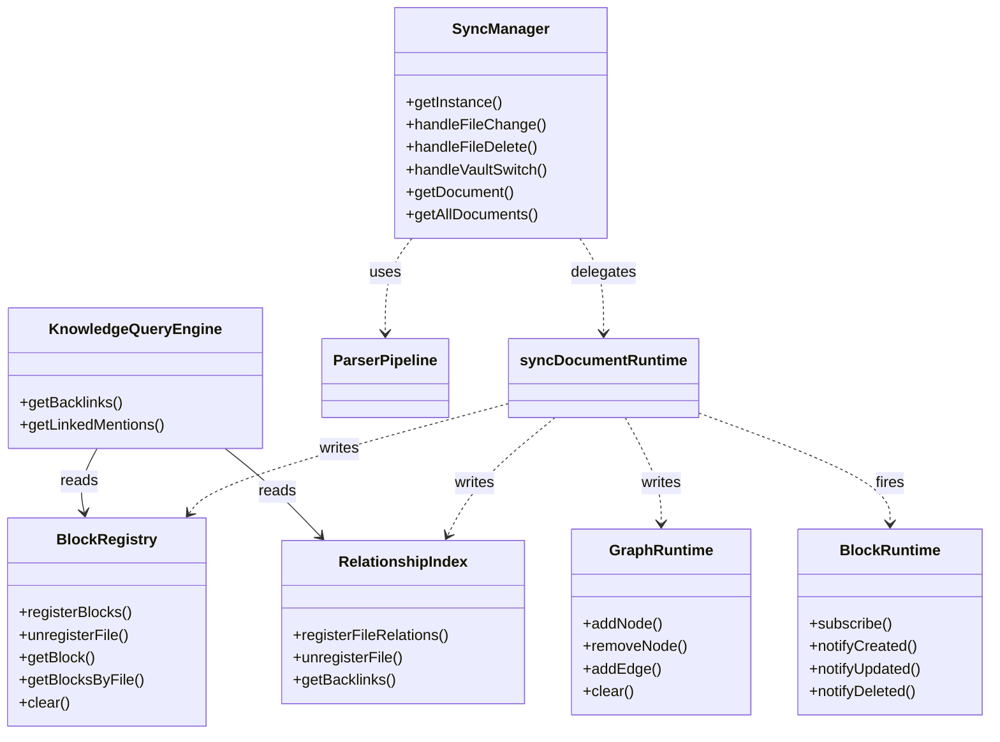
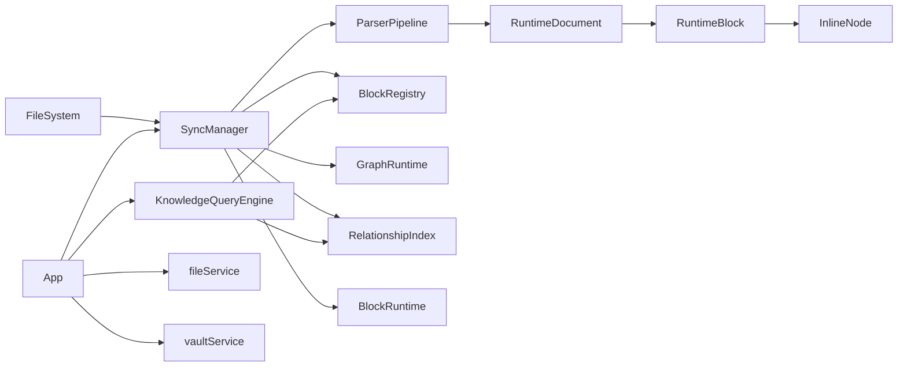
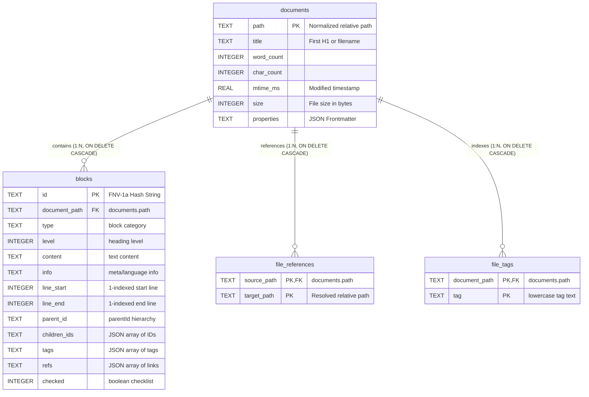

# ERD — Entity Relationship Diagram




# Class Diagram
Mermaid có hỗ trợ `classDiagram`, nhưng với schema của bạn nên chia thành **3 diagram** thay vì nhét tất cả vào một cái. Nếu cố gắng render toàn bộ, Mermaid sẽ thành một mớ dây.

## 1. Domain Model



---

## 2. Knowledge Graph Model



---

## 3. Runtime / Service Architecture



---

## 4. High-Level Architecture (thứ hữu ích nhất)

Thực ra đây là diagram mà dev thường xem nhiều nhất:




```
┌─────────────────────┐
│        VAULT        │
├─────────────────────┤
│ PK  vaultPath       │
│     name            │
│     lastOpened      │
└──────────┬──────────┘
           │ 1
           │ contains
           │ *
┌──────────▼──────────────┐          ┌──────────────────────────┐
│       DOCUMENT          │          │        PROPERTY          │
├─────────────────────────┤          ├──────────────────────────┤
│ PK  path                │ 1      * │ PK  id                   │
│     title               ├──────────┤ FK  documentPath         │
│     wordCount           │ has      │     key                  │
│     charCount           │          │     value                │
└────────────┬────────────┘          │     type                 │
             │ 1                     │     (text|list|date|     │
             │ contains              │      checkbox|number)    │
             │ *                     └──────────────────────────┘
┌────────────▼────────────┐
│         BLOCK           │◄──────────────────────┐
├─────────────────────────┤                        │ 0..1 parent
│ PK  id  (block://hash)  │                        │ *   children
│ FK  documentPath        │ self-referential ──────┘
│     type                │
│     (heading|paragraph  │          ┌──────────────────────────┐
│      list-item|quote|   │          │       INLINE_NODE        │
│      code|table|        │          ├──────────────────────────┤
│      callout|empty)     │ 1      * │ PK  id                   │
│     content             ├──────────┤ FK  blockId              │
│     level               │ contains │     type                 │
│     info                │          │     (text|wikilink|embed │
│     lineStart           │          │      hashtag|bold|       │
│     lineEnd             │          │      italic|code)        │
│     checked             │          │     content              │
│ FK  parentId            │          │     raw                  │
└─────────────────────────┘          │     position             │
                                     └──────────────────────────┘

┌─────────────────────────┐          ┌──────────────────────────┐
│       DOCUMENT          │          │          TAG             │
│  (from above)           │ *      * ├──────────────────────────┤
│                         ├──────────┤ PK  name                 │
└─────────────────────────┘ tagged   └──────────────────────────┘
           through DOCUMENT_TAG
  ┌──────────────────────────────┐
  │        DOCUMENT_TAG          │
  ├──────────────────────────────┤
  │ FK  documentPath             │
  │ FK  tagName                  │
  │     source (frontmatter|     │
  │             inline)          │
  └──────────────────────────────┘

┌─────────────────────────┐
│       DOCUMENT          │ self-referential (wikilinks)
│  (from above)           │──────────────────┐
└─────────────────────────┘                  │
           through REFERENCE                 │
  ┌──────────────────────────────┐           │
  │          REFERENCE           │◄──────────┘
  ├──────────────────────────────┤
  │ FK  sourceDocPath            │
  │ FK  targetDocPath            │
  │     anchor  (nullable)       │
  │     refType                  │
  │     (file|header|block)      │
  └──────────────────────────────┘

┌─────────────────────────┐          ┌──────────────────────────┐
│       GRAPH_NODE        │          │        GRAPH_EDGE        │
├─────────────────────────┤          ├──────────────────────────┤
│ PK  id                  │ 1  *     │ PK  id                   │
│     (doc://path,        ├──────────┤ FK  sourceId             │
│      block://hash,      │ source   │ FK  targetId             │
│      tag://name)        │          │     type                 │
│     type                │ 1  *     │     (link|embed|         │
│     (document|block|tag)├──────────┤      tag|block-ref)      │
│     name                │ target   └──────────────────────────┘
└─────────────────────────┘
```

---

## ERD — Cardinality Summary

|Relationship|Cardinality|Ghi chú|
|---|---|---|
|Vault → Document|1 : N|Một vault chứa nhiều files|
|Document → Block|1 : N|Một note có nhiều blocks|
|Document → Property|1 : N|Frontmatter key-value|
|Block → InlineNode|1 : N|Inline elements trong block|
|Block → Block|0..1 : N|Self-ref: list nesting|
|Document ↔ Tag|N : M|Qua bảng DocumentTag|
|Document ↔ Document|N : M|Qua bảng Reference (wikilinks)|
|GraphNode → GraphEdge|1 : N|source hoặc target|

---

# Class Diagram

```
«interface»                         «interface»
VaultInfo                           ExplorerNode
─────────────────                   ─────────────────────────
+ vaultPath: string                 «union»
+ name: string                      FolderNode | FileNode
+ lastOpened: string
                                    «interface» FolderNode
                                    ─────────────────────────
                                    + name: string
                                    + path: string
                                    + isFolder: true
                                    + children: ExplorerNode[]

                                    «interface» FileNode
                                    ─────────────────────────
                                    + name: string
                                    + path: string
                                    + isFolder: false

«interface»                         «interface»
InlineNode                          BlockMetadata
─────────────────────               ─────────────────────────
+ type: InlineNodeType              + sourceFile: string
+ content: string                   + lineStart: number
+ raw: string                       + lineEnd: number
                                    + parentId?: string
                                    + childrenIds?: string[]
                                    + checked?: boolean
                                    + tags: string[]
                                    + references: string[]

«interface»
RuntimeBlock
─────────────────────────────────────────────────
+ id: string                ◄── "block://hash"
+ type: BlockType
+ level?: number
+ content: string
+ info?: string
+ children: InlineNode[]    ───────────────────────────► InlineNode (1..*)
+ parentId?: string | null
+ childrenIds?: string[]
+ metadata: BlockMetadata   ────────────────────────────► BlockMetadata (1)

«interface»
RuntimeDocument
─────────────────────────────────────────────────
+ path: string
+ title: string
+ blocks: RuntimeBlock[]    ───────────────────────────► RuntimeBlock (0..*)
+ tags: string[]
+ references: string[]
+ wordCount: number
+ charCount: number

«interface»                         «interface»
GraphNode                           GraphEdge
─────────────────────               ─────────────────────────
+ id: string                        + source: string
+ type: GraphNodeType               + target: string
+ name: string                      + type: EdgeType

«interface»
ResolvedReference                   «interface»
─────────────────────               LinkedMention
+ targetFile: string                ─────────────────────────
+ anchor?: string                   + sourceFile: string
+ type: 'file'|'header'|'block'     + block: RuntimeBlock
```

---

```
«singleton»                                        «singleton»
SyncManager                                        BlockRegistry
────────────────────────────────                   ──────────────────────────────────
- documents: Map<string,                           - blocks: Map<string, RuntimeBlock>
             RuntimeDocument>                      - fileToBlocks: Map<string, Set<string>>
──────────────────────────────                     ──────────────────────────────────
+ getInstance(): SyncManager                       + getInstance(): BlockRegistry
+ handleFileChange(): RuntimeDocument              + registerBlocks(filePath, blocks)
+ handleFileDelete(): void                         + unregisterFile(filePath)
+ handleVaultSwitch(): void                        + getBlock(id): RuntimeBlock
+ getDocument(): RuntimeDocument                   + getBlocksByFile(filePath)
+ getAllDocuments(): RuntimeDocument[]             + clear()

         │ uses                                             ▲
         │                                                  │ registers
         ▼                                                  │
«module»                                                    │
syncDocumentRuntime()  ─────────────────────────────────────┘
────────────────────────────────
  uses: BlockRegistry
  uses: BlockRuntime            ──────────────────────────────────────────────►
  uses: GraphRuntime            ──────────────────────────────────────────────►
  uses: RelationshipIndex       ──────────────────────────────────────────────►
  uses: diffBlocks()

«singleton»                     «singleton»                  «singleton»
BlockRuntime                    GraphRuntime                 RelationshipIndex
────────────────────────        ──────────────────────────   ────────────────────────────
- listeners:                    - nodes: Map<string,         - backlinks:
  Set<BlockLifecycleListener>            GraphNode>            Map<string, Set<string>>
────────────────────────        - edgeKeys: Set<string>      - forwardReferences:
+ getInstance()                 ──────────────────────────     Map<string, Set<string>>
+ subscribe(listener)           + getInstance()              - tagIndex:
+ notifyCreated(block)          + addNode(node)                Map<string, Set<string>>
+ notifyUpdated(block)          + removeNode(id)             - fileTags:
+ notifyDeleted(blockId)        + addEdge(edge)                Map<string, Set<string>>
                                + clear()                    ────────────────────────────
                                                             + getInstance()
                                                             + registerFileRelations()
                                                             + unregisterFile()
                                                             + getBacklinks()

«singleton»
KnowledgeQueryEngine
──────────────────────────────────────────────────────
- relationshipIndex: RelationshipIndex  ─────────────────────► RelationshipIndex
- blockRegistry: BlockRegistry          ─────────────────────► BlockRegistry
──────────────────────────────────────────────────────
+ getInstance(): KnowledgeQueryEngine
+ getBacklinks(filePath): string[]
+ getLinkedMentions(targetPath, allPaths): LinkedMention[]

«module»                         «module»
ParserPipeline                   GraphUtils
──────────────────────────────   ────────────────────────────
parseMarkdownToRawBlocks()       resolveLinkPath()
buildRuntimeBlocks()             parseReferenceTarget()
normalizeRuntimeBlocks()         extractDocumentReferences()
extractBlocksFromMarkdown()      extractDocumentTags()
parseFrontmatter()
serializeBlocksToMarkdown()
serializeFrontmatter()
tokenizeInlineContent()

«service»                        «service»
fileService                      vaultService
──────────────────────────────   ────────────────────────────
readFile()                       getVaultInfo()
writeFile()                      selectVaultDir()
createFile()
createFolder()
deleteItem()
moveItem()
getVaultTree()
```

---

## Class Relationship Summary

```
SyncManager
    │
    ├──uses──► ParserPipeline       (parse raw content)
    ├──uses──► syncDocumentRuntime  (delegate update)
    │               │
    │               ├──writes──► BlockRegistry       (cache blocks)
    │               ├──writes──► GraphRuntime        (nodes & edges)
    │               ├──writes──► RelationshipIndex   (backlinks/tags)
    │               └──fires───► BlockRuntime        (lifecycle events)
    │
    └──reads──► RuntimeDocument     (getDocument / getAllDocuments)

KnowledgeQueryEngine
    ├──reads──► RelationshipIndex   (backlinks lookup)
    └──reads──► BlockRegistry       (fetch block content for mentions)

App.tsx (UI)
    ├──calls──► fileService         (disk I/O)
    ├──calls──► vaultService        (vault management)
    ├──calls──► SyncManager         (trigger sync, read documents)
    └──calls──► KnowledgeQueryEngine (backlinks for right panel)
```

---

## Enum Types

```
BlockType                    InlineNodeType              GraphNodeType
─────────────────            ─────────────────           ─────────────────
heading                      text                        document
paragraph                    wikilink                    block
list-item                    embed                       tag
quote                        hashtag
code                         bold                        EdgeType
table                        italic                      ─────────────────
callout                      code                        link
empty                                                    embed
                                                         tag
PropertyType                                             block-ref
─────────────────
text
list
date
checkbox
number
```

---

# Physical SQLite Database ERD

To support the local caching and index synchronization layer, the physical SQLite schema represents vault metadata, outliner blocks, and graph relations using the following table structure:

