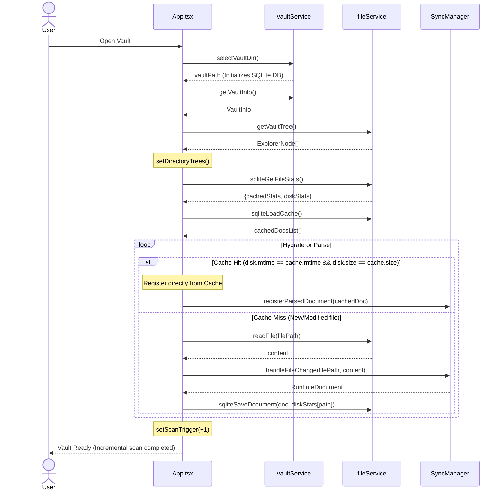
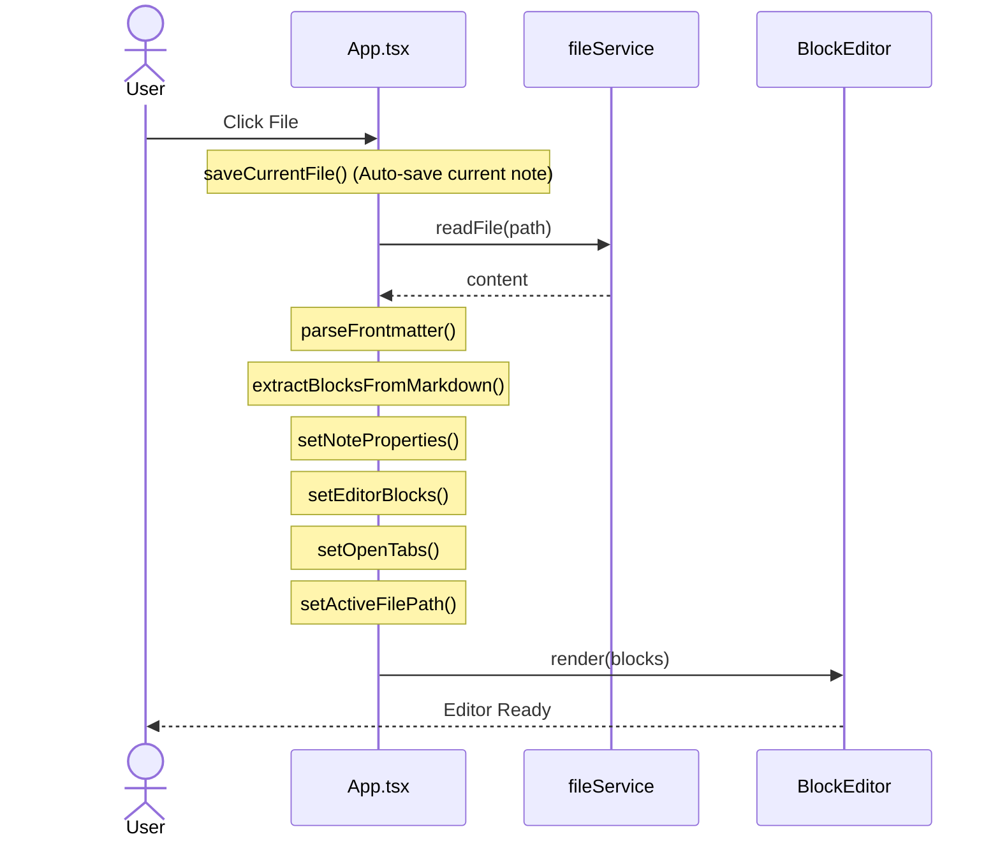
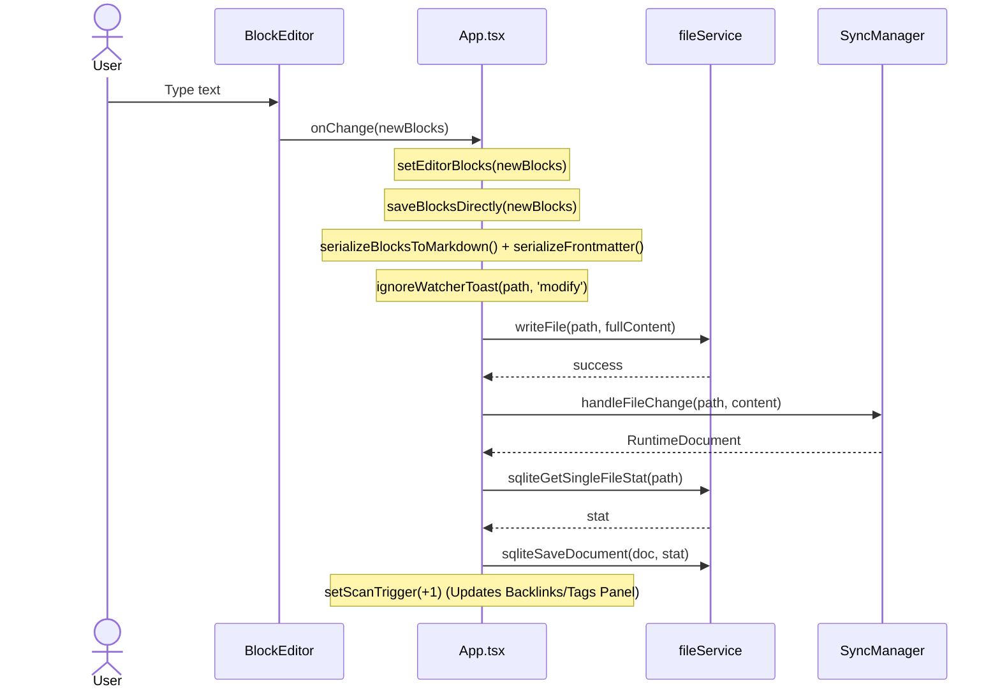
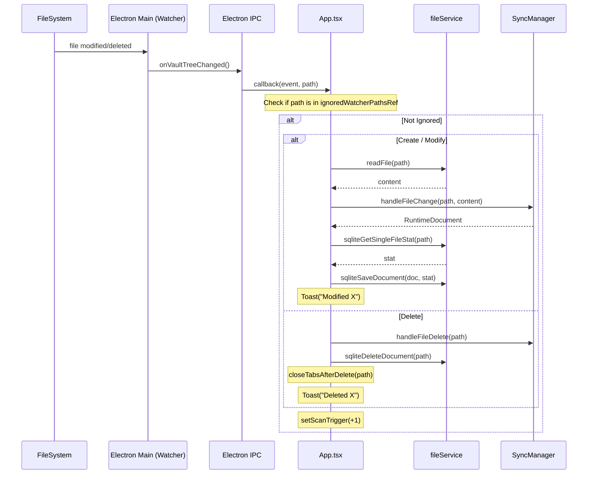
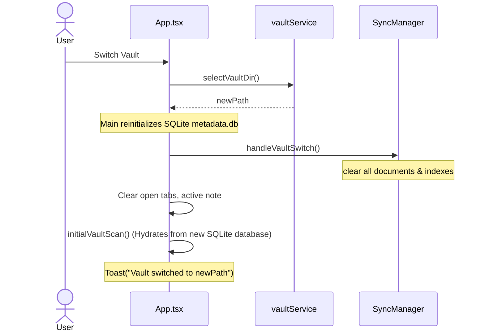

# Physical File Design

## Directory Tree

```
Module Test/
│
├── index.html                         ← HTML entry point (Vite)
├── tsconfig.json                      ← TypeScript base config
├── tsconfig.app.json                  ← App-specific TS config
├── tsconfig.node.json                 ← Node/tooling TS config
├── eslint.config.js                   ← ESLint rules
│
├── database_service.cjs               ← SQLite connection & DDL/query manager (sql.js)
├── file_watcher.cjs                   ← Legacy file system watcher wrapper
├── vault_watcher.cjs                  ← Dynamic file watcher lifecycle manager
├── main.cjs                           ← Electron Main entry: window, IPC channels
├── preload.cjs                        ← Electron Preload bridge: exposes electron API
│
├── public/
│   ├── favicon.svg
│   └── icons.svg
│
├── dist/                              ← Build output (generated)
│   ├── favicon.svg
│   └── icons.svg
│
├── vault/                             ← Default notes vault directory
│   ├── README.md                      ← Welcome note
│   └── .module-test/
│       └── metadata.db                ← SQLite database file (ignored in git)
│
└── src/
    ├── main.tsx                       ← React DOM entry, mounts <App/>
    ├── index.css                      ← Global styles (Tailwind)
    ├── App.tsx                        ← Root component + state orchestrator
    │
    ├── types.ts                       ← Shared UI types
    ├── file_Service.ts                ← IPC wrapper: file I/O & SQLite queries
    ├── vault_Service.ts               ← IPC wrapper: vault management
    │
    ├── assets/
    │   ├── hero.png
    │   ├── react.svg
    │   └── vite.svg
    │
    ├── utils/
    │   └── markdown.ts                ← Legacy markdown renderer (HTML)
    │
    ├── components/
    │   └── BlockEditor.tsx            ← Block-based editor component
    │
    └── runtime/
        ├── types/
        │   └── runtime-types.ts       ← All shared runtime interfaces & enums
        │
        ├── parser/
        │   ├── markdown-parser.ts     ← Raw MD → RawBlock[], frontmatter parse/serialize
        │   ├── runtime-builder.ts     ← RawBlock[] → RuntimeBlock[], inline tokenizer
        │   ├── runtime-normalizer.ts  ← Set parentId/childrenIds hierarchy
        │   └── block-extractor.ts     ← Facade: 3-stage pipeline
        │
        ├── sync/
        │   ├── sync-manager.ts        ← Singleton entry, documents cache
        │   ├── runtime-sync.ts        ← Orchestrate Registry/Graph/Index updates
        │   ├── block-diff.ts          ← Diff old/new blocks → lifecycle events
        │   └── ast-diff.ts            ← AST-level diff helper
        │
        ├── store/
        │   ├── block-registry.ts      ← Global block cache (Map<id, RuntimeBlock>)
        │   └── block-runtime.ts       ← Block lifecycle event bus
        │
        ├── graph/
        │   ├── graph-runtime.ts       ← In-memory graph (nodes + edges)
        │   ├── relationship-index.ts  ← Backlinks, forwardRefs, tagIndex
        │   ├── knowledge-query-engine.ts ← Query API for UI
        │   ├── link-resolver.ts       ← Resolve [[wikilink]] → path
        │   └── reference-extractor.ts ← Extract refs/tags from blocks
        │
        └── utils/
            └── id-generator.ts        ← FNV-1a block ID hash
```

---

## File Dependency Map

```
main.tsx
  └── App.tsx
        ├── types.ts
        ├── file_Service.ts
        │     └── types.ts
        ├── vault_Service.ts
        │     └── types.ts
        ├── components/BlockEditor.tsx
        │     ├── runtime/types/runtime-types.ts
        │     ├── runtime/parser/markdown-parser.ts
        │     ├── runtime/parser/runtime-builder.ts
        │     ├── runtime/parser/runtime-normalizer.ts
        │     └── file_Service.ts
        ├── runtime/sync/sync-manager.ts
        │     ├── runtime/parser/block-extractor.ts
        │     │     ├── runtime/parser/markdown-parser.ts
        │     │     ├── runtime/parser/runtime-builder.ts
        │     │     │     └── runtime/utils/id-generator.ts
        │     │     └── runtime/parser/runtime-normalizer.ts
        │     ├── runtime/parser/markdown-parser.ts
        │     ├── runtime/sync/runtime-sync.ts
        │     │     ├── runtime/store/block-registry.ts
        │     │     ├── runtime/store/block-runtime.ts
        │     │     ├── runtime/graph/graph-runtime.ts
        │     │     ├── runtime/graph/relationship-index.ts
        │     │     ├── runtime/graph/link-resolver.ts
        │     │     └── runtime/sync/block-diff.ts
        │     ├── runtime/store/block-registry.ts
        │     ├── runtime/graph/graph-runtime.ts
        │     └── runtime/graph/relationship-index.ts
        ├── runtime/graph/knowledge-query-engine.ts
        │     ├── runtime/graph/relationship-index.ts
        │     ├── runtime/store/block-registry.ts
        │     └── runtime/graph/link-resolver.ts
        └── runtime/graph/link-resolver.ts
```

---

# UML Sequence Diagrams

---

### SD-01 — Open Vault (with SQLite Hydration)



```
User          App.tsx        vaultService     fileService     SyncManager
 │                │                │               │               │
 │  click         │                │               │               │
 │───────────────►│                │               │               │
 │                │ selectVaultDir()               │               │
 │                │───────────────►│               │               │
 │                │   [Electron OS dialog]         │               │
 │                │◄───────────────│               │               │
 │                │    path                        │               │
 │                │                │               │               │
 │                │ getVaultInfo()  │               │               │
 │                │───────────────►│               │               │
 │                │◄───────────────│               │               │
 │                │  VaultInfo     │               │               │
 │                │                │               │               │
 │                │ getVaultTree()  │               │               │
 │                │────────────────────────────────►               │
 │                │◄────────────────────────────────               │
 │                │  ExplorerNode[]                │               │
 │                │                │               │               │
 │                │ setDirectoryTrees()            │               │
 │                │                │               │               │
 │                │ sqliteGetFileStats() ─────────►│               │
 │                │ sqliteLoadCache() ────────────►│               │
 │                │◄── cached stats & docs ────────│               │
 │                │                                │               │
 │                │ ─ initialVaultScan() ──────────┼───────────────►
 │                │   for each file:               │               │
 │                │     if Cached:                 │               │
 │                │       registerParsedDocument() ────────────────►
 │                │     else (Modified):           │               │
 │                │       readFile(path) ─────────►│               │
 │                │       content ◄────────────────│               │
 │                │       handleFileChange() ──────────────────────►
 │                │       sqliteSaveDocument() ───►│               │
 │                │                                │               │
 │                │ setScanTrigger(+1)             │               │
 │◄───────────────│                                │               │
 │  Vault ready   │                                │               │
```

---

### SD-02 — Open Note (Click file)



```
User         App.tsx         fileService       SyncManager    BlockEditor
 │               │                │                 │               │
 │  click file   │                │                 │               │
 │──────────────►│                │                 │               │
 │               │ saveCurrentFile()               │               │
 │               │  (save previous note first)     │               │
 │               │                │                 │               │
 │               │ readFile(path) │                 │               │
 │               │───────────────►│                 │               │
 │               │◄───────────────│                 │               │
 │               │   content      │                 │               │
 │               │                │                 │               │
 │               │ parseFrontmatter(content)        │               │
 │               │  → {properties, remainingContent}│               │
 │               │                │                 │               │
 │               │ extractBlocksFromMarkdown(remainingContent, path)│
 │               │  → RuntimeBlock[]               │               │
 │               │                │                 │               │
 │               │ setNoteProperties(properties)   │               │
 │               │ setEditorBlocks(blocks)          │               │
 │               │                │                 │               │
 │               │ setOpenTabs([...newTab])         │               │
 │               │ setActiveFilePath(path)          │               │
 │               │                │                 │               │
 │               │────────────── render ──────────────────────────►│
 │◄──────────────│                │                 │   blocks[]    │
 │  Editor ready │                │                 │               │
```

---

### SD-03 — Edit & Auto-Save Note (with SQLite Sync)



```
User         BlockEditor       App.tsx        fileService      SyncManager
 │               │                │                │                │
 │  type text    │                │                │                │
 │──────────────►│                │                │                │
 │               │ onChange(newBlocks)             │                │
 │               │───────────────►│                │                │
 │               │                │                │                │
 │               │   setEditorBlocks(newBlocks)    │                │
 │               │                │                │                │
 │               │   saveBlocksDirectly(newBlocks) │                │
 │               │                │                │                │
 │               │   serializeBlocksToMarkdown()   │                │
 │               │   serializeFrontmatter()        │                │
 │               │   → fullContent                 │                │
 │               │                │                │                │
 │               │   ignoreWatcherToast(path)      │                │
 │               │                │                │                │
 │               │                │ writeFile(path, content)        │
 │               │                │───────────────►│                │
 │               │                │◄───────────────│                │
 │               │                │   success      │                │
 │               │                │                │                │
 │               │                │ handleFileChange(path, content) │
 │               │                │─────────────────────────────── ►│
 │               │                │                │  parse+diff    │
 │               │                │                │  update indexes│
 │               │                │◄────────────────────────────────│
 │               │                │                │                │
 │               │                │ sqliteGetSingleFileStat() ─────►│
 │               │                │ sqliteSaveDocument(doc, stat) ──►│
 │               │                │ setScanTrigger(+1)              │
```

---

### SD-04 — Navigate via Wikilink

```
User        BlockEditor        App.tsx         fileService      SyncManager
 │               │                │                 │                │
 │  click        │                │                 │                │
 │ [[John]]      │                │                 │                │
 │──────────────►│                │                 │                │
 │               │ onWikilinkClick("John")          │                │
 │               │───────────────►│                 │                │
 │               │                │                 │                │
 │               │   resolveLinkPath("John",        │                │
 │               │     activeFilePath, allPaths)    │                │
 │               │                │                 │                │
 │               │           ┌───┴────────────────────────────────┐ │
 │               │           │  FOUND?                            │ │
 │               │           ├────────────────────────────────────┤ │
 │               │           │  YES → handleSelectFile(resolved)  │ │
 │               │           │        (see SD-02)                 │ │
 │               │           │                                    │ │
 │               │           │  NO  → confirm("Create note?")     │ │
 │               │           │         │                          │ │
 │               │           │    YES  │                          │ │
 │               │           │         ▼                          │ │
 │               │           │  createFile(path, "# John\n\n")    │ │
 │               │           │         │                          │ │
 │               │           │  handleFileChange(path, ...)       │ │
 │               │           │  (pre-cache in SyncManager)        │ │
 │               │           │         │                          │ │
 │               │           │  loadTree()  (refresh explorer)    │ │
 │               │           │         │                          │ │
 │               │           │  handleSelectFile(path)            │ │
 │               │           │  (open new note in editor)         │ │
 │               │           └────────────────────────────────────┘ │
 │◄──────────────│                │                 │                │
 │  Note opened  │                │                 │                │
```

---

### SD-05 — External File Change (with SQLite Cache Refresh)



```
FileSystem      Electron Main    Electron IPC      App.tsx       SyncManager
 │                   │                │                │                │
 │  file modified    │                │                │                │
 │  (external tool)  │                │                │                │
 │──────────────────►│                │                │                │
 │                   │ onVaultTreeChanged(event)       │                │
 │                   │───────────────►│                │                │
 │                   │                │ callback fired │                │
 │                   │                │───────────────►│                │
 │                   │                │   {event, type, path}          │
 │                   │                │                │                │
 │                   │                │   getVaultTree()               │
 │                   │                │   setDirectoryTrees()          │
 │                   │                │                │                │
 │                   │                │   check: ignoredWatcherPaths?  │
 │                   │                │                │                │
 │                   │                │   ┌────────────┴──────────────┐ │
 │                   │                │   │  NOT ignored              │ │
 │                   │                │   │                           │ │
 │                   │                │   │  if event = modify/create │ │
 │                   │                │   │    readFile(path)         │ │
 │                   │                │   │    handleFileChange(...)──►│
 │                   │                │   │    sqliteSaveDocument() ──►│
 │                   │                │   │    setScanTrigger(+1)      │
 │                   │                │   │    addToast("Modified X")  │
 │                   │                │   │                           │ │
 │                   │                │   │  if event = delete        │ │
 │                   │                │   │    handleFileDelete(...)──►│
 │                   │                │   │    sqliteDeleteDoc() ────►│
 │                   │                │   │    closeTabsAfterDelete()  │
 │                   │                │   │    addToast("Deleted X")   │
 │                   │                │   └───────────────────────────┘ │
```

---

### SD-06 — Add Property to Note

```
User            App.tsx          fileService        SyncManager
 │                  │                 │                   │
 │ click "+Add"     │                 │                   │
 │─────────────────►│                 │                   │
 │                  │ setIsAddingProperty(true)           │
 │◄─────────────────│  (inline form renders)              │
 │                  │                 │                   │
 │ type name+type   │                 │                   │
 │ press Enter      │                 │                   │
 │─────────────────►│                 │                   │
 │                  │ handleSaveNewProperty()             │
 │                  │  defaultValue = type-based default  │
 │                  │  updated = {...props, [key]: default}│
 │                  │  setNoteProperties(updated)         │
 │                  │                 │                   │
 │                  │ savePropertiesDirectly(updated)     │
 │                  │  serializeFrontmatter(updated)      │
 │                  │  serializeBlocksToMarkdown(blocks)  │
 │                  │  → fullContent  │                   │
 │                  │                 │                   │
 │                  │ ignoreWatcherToast(path, 'modify')  │
 │                  │                 │                   │
 │                  │  writeFile(path, fullContent)       │
 │                  │────────────────►│                   │
 │                  │◄────────────────│                   │
 │                  │   success       │                   │
 │                  │                 │                   │
 │                  │  handleFileChange(path, content)───►│
 │                  │  sqliteSaveDocument(doc, stat) ────►│
 │                  │  setScanTrigger(+1)                 │
 │◄─────────────────│  (UI re-renders with new property)  │
```

---

### SD-07 — Switch Vault



```
User          App.tsx        vaultService     fileService     SyncManager
 │                │                │               │                │
 │  click vault   │                │               │                │
 │  path footer   │                │               │                │
 │───────────────►│                │               │                │
 │                │ selectVaultDir()               │                │
 │                │───────────────►│               │                │
 │                │◄───────────────│               │                │
 │                │  newPath       │               │                │
 │                │                │               │                │
 │                │ [Electron onVaultChanged fires]                  │
 │                │  (Initializes metadata.db for new vault)         │
 │                │                │               │                │
 │                │ handleVaultSwitch() ───────────────────────────►│
 │                │                │               │  clear():       │
 │                │                │               │  documents      │
 │                │                │               │  BlockRegistry  │
 │                │                │               │  GraphRuntime   │
 │                │                │               │  RelationIndex  │
 │                │◄───────────────────────────────────────────────  │
 │                │                │               │                │
 │                │ getVaultTree() │               │                │
 │                │ setOpenTabs([]) │               │                │
 │                │                │               │                │
 │                │ ── initialVaultScan() ─────────────────────────►│
 │                │    (Hydrates stats & documents from SQLite)      │
 │                │                │               │                │
 │                │ addToast("Vault switched to X")                  │
 │◄───────────────│                │               │                │
```

---

## SD Summary

| SD | Trigger | Major Actor | SQLite Involvement |
| --- | --- | --- | --- |
| **SD-01** | App startup / Open vault | User | Reads stats and loads document cache (hydration) |
| **SD-02** | Click note in Explorer | User | None (Reads file content directly from disk) |
| **SD-03** | Auto-save block changes | User (implicit) | Saves document statistics and blocks to cache |
| **SD-04** | Click `[[wikilink]]` | User | Updates temporarily in memory, saves once note created |
| **SD-05** | Watcher catches file edit | FS Watcher | Incremental update or delete of SQLite records |
| **SD-06** | Add property metadata | User | Saves note properties and stats to SQLite |
| **SD-07** | Footer click / Switch vault | User | Disconnects old database, creates new metadata.db |
