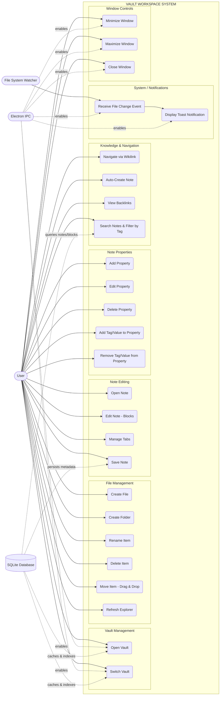
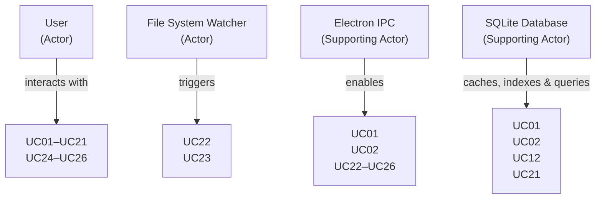

# UseCase Diagram & Specification — Vault Workspace






```
┌──────────────────────────────────────────────────────────────────────────────────┐
│                              VAULT WORKSPACE SYSTEM                              │
│                                                                                  │
│  ┌──────────────────────────────┐    ┌──────────────────────────────────────┐    │
│  │     VAULT MANAGEMENT         │    │        FILE MANAGEMENT               │    │
│  │                              │    │                                      │    │
│  │  (UC01) Open Vault           │    │  (UC03) Create File                  │    │
│  │  (UC02) Switch Vault         │    │  (UC04) Create Folder                │    │
│  └──────────────────────────────┘    │  (UC05) Rename Item                  │    │
│                                      │  (UC06) Delete Item                  │    │
│  ┌──────────────────────────────┐    │  (UC07) Move Item (Drag & Drop)      │    │
│  │     NOTE EDITING             │    │  (UC08) Refresh Explorer             │    │
│  │                              │    └──────────────────────────────────────┘    │
│  │  (UC09)  Open Note           │                                                │
│  │  (UC10)  Edit Note (Blocks)  │    ┌──────────────────────────────────────┐    │
│  │  (UC11)  Manage Tabs         │    │      NOTE PROPERTIES                 │    │
│  │  (UC12)  Save Note           │    │                                      │    │
│  └──────────────────────────────┘    │  (UC13) Add Property                 │    │
│                                      │  (UC14) Edit Property                │    │
│  ┌──────────────────────────────┐    │  (UC15) Delete Property              │    │
│  │   KNOWLEDGE & NAVIGATION     │    │  (UC16) Add Tag/Value to Property    │    │
│  │                              │    │  (UC17) Remove Tag/Value from Prop   │    │
│  │  (UC18) Navigate via Wikilink│    └──────────────────────────────────────┘    │
│  │  (UC19) Auto-Create Note     │                                                │
│  │  (UC20) View Backlinks       │    ┌──────────────────────────────────────┐    │
│  │  (UC21) Search Notes & Tag Filter│    │     SYSTEM / NOTIFICATIONS           │    │
│  └──────────────────────────────┘    │                                      │    │
│                                      │  (UC22) Receive File Change Event    │    │
│  ┌──────────────────────────────┐    │  (UC23) Display Toast Notification   │    │
│  │     WINDOW CONTROLS          │    └──────────────────────────────────────┘    │
│  │                              │                                                │
│  │  (UC24) Minimize Window      │                                                │
│  │  (UC25) Maximize Window      │                                                │
│  │  (UC26) Close Window         │                                                │
│  └──────────────────────────────┘                                                │
└──────────────────────────────────────────────────────────────────────────────────┘

           ACTORS
           ──────
     ┌──────────┐          ┌──────────────────┐
     │          │          │                  │
     │   User   │          │  File System     │
     │  (Actor) │          │  Watcher (Actor) │
     └──────────┘          └──────────────────┘
          │                         │
          │ interacts with          │ triggers
          ▼                         ▼
   UC01–UC21, UC24–UC26         UC22, UC23

        ┌────────────────────────┐          ┌────────────────────────┐
        │    Electron IPC        │          │    SQLite Database     │
        │  (Supporting Actor)    │          │  (Supporting Actor)    │
        └────────────────────────┘          └────────────────────────┘
                   │ enables                           │ caches, indexes
                   ▼                                   ▼ & queries
           UC01, UC02, UC22–UC26               UC01, UC02, UC12, UC21
```

---

## UseCase Specifications

---

### UC01 — Open Vault

|Field|Description|
|---|---|
|**Actor**|User, Electron IPC (Supporting Actor), SQLite Database (Supporting Actor)|
|**Precondition**|Ứng dụng đang chạy; hoặc chưa có Vault nào được mở, hoặc tự động tải Vault trước đó đã lưu trong AppData configuration.|
|**Trigger**|User click "Open Vault" trên Sidebar hoặc màn hình chào, hoặc tải tự động khi khởi động.|
|**Main Flow**|1. User click nút "Open Vault" → 2. Electron IPC hiển thị dialog chọn thư mục (`select-vault-dir`) → 3. User chọn thư mục → 4. System lưu đường dẫn vào AppData Store, khởi tạo cơ sở dữ liệu SQLite tại thư mục `.module-test/metadata.db` và load file tree (`fileService.getVaultTree()`) → 5. Thực hiện **SQLite Hydration**: <br/> &nbsp;&nbsp;&nbsp;&nbsp;a. System gửi yêu cầu IPC `sqlite-get-file-stats` và `sqlite-load-cache` để so sánh `mtimeMs` và `size` của tất cả các file `.md` trên đĩa với thông tin đã lưu trong SQLite Database.<br/> &nbsp;&nbsp;&nbsp;&nbsp;b. Với các file trùng khớp (không thay đổi), `SyncManager` nạp trực tiếp dữ liệu `RuntimeDocument` đã phân tích từ SQLite cache (`registerParsedDocument()`) bỏ qua bước đọc file và phân tích Markdown.<br/> &nbsp;&nbsp;&nbsp;&nbsp;c. Với các file mới hoặc đã thay đổi, System đọc nội dung (`fileService.readFile()`), phân tích cú pháp Markdown, xây dựng BlockRegistry, GraphRuntime, RelationshipIndex và lưu lại vào SQLite Database (`sqliteSaveDocument()`).<br/> &nbsp;&nbsp;&nbsp;&nbsp;d. Xóa bản ghi trong SQLite đối với các file đã bị xóa trên đĩa (`sqliteDeleteDocument()`). <br/> 6. File explorer hiển thị cây thư mục mới, Toast thông báo hoàn thành.|
|**Alternate Flow**|User huỷ dialog chọn thư mục → Không có thay đổi nào xảy ra.|
|**Postcondition**|Vault được kích hoạt, Explorer hiển thị, index in-memory được đồng bộ hóa với file thực tế thông qua bộ nhớ cache SQLite.|

---

### UC02 — Switch Vault

|Field|Description|
|---|---|
|**Actor**|User, Electron IPC, SQLite Database|
|**Precondition**|Đang có một Vault đang hoạt động.|
|**Trigger**|User click vào đường dẫn vault hiện tại ở sidebar footer, hoặc nút "+" trong sidebar.|
|**Main Flow**|1. User chọn thư mục mới qua dialog chọn thư mục → 2. Electron IPC cập nhật lại cấu hình vault mới, đóng DB cũ và khởi tạo SQLite Database mới tại `.module-test/metadata.db` của vault mới → 3. Client reset danh sách tabs mở (`openTabs = []`, `activeTabPath = null`) → 4. Client gọi `SyncManager.handleVaultSwitch()` xóa sạch cache in-memory (`documents.clear()`, `BlockRegistry.clear()`, `GraphRuntime.clear()`, `RelationshipIndex.clear()`) → 5. Bắt đầu quy trình quét và tải cơ sở dữ liệu mới thông qua **SQLite Hydration** (tương tự bước 5 ở UC01) → 6. Hiển thị Toast "Vault switched to [Name]".|
|**Postcondition**|Vault mới được mở và cache được làm mới; các tab, index và cơ sở dữ liệu của vault cũ được giải phóng hoàn toàn.|

---

### UC03 — Create File

|Field|Description|
|---|---|
|**Actor**|User, File System Watcher, SQLite Database|
|**Precondition**|Vault đang mở.|
|**Trigger**|User click nút "New File" trên sidebar toolbar, hoặc click chuột phải trên Explorer > chọn "New File".|
|**Main Flow**|1. Inline input xuất hiện trong Explorer tại thư mục được chọn hoặc root → 2. User nhập tên file (`.md` tự động được thêm nếu thiếu) → 3. Enter hoặc blur để xác nhận → 4. `fileService.createFile()` ghi file mới lên đĩa với nội dung tiêu đề mặc định `# <tên>` → 5. File System Watcher phát hiện sự kiện tạo file, reload Explorer → 6. `SyncManager` cập nhật index in-memory, lưu metadata/blocks vào SQLite cache (`sqliteSaveDocument`) → 7. File tự động mở trong editor.|
|**Alternate Flow**|User nhấn Escape hoặc blur khi input rỗng → Huỷ, không tạo file.|
|**Postcondition**|File `.md` mới được tạo trên đĩa, cập nhật vào SQLite cache và tự động hiển thị trong Editor.|

---

### UC04 — Create Folder

|Field|Description|
|---|---|
|**Actor**|User, File System Watcher|
|**Precondition**|Vault đang mở.|
|**Trigger**|User click nút "New Folder" trên sidebar toolbar, hoặc click chuột phải trên Explorer > chọn "New Folder".|
|**Main Flow**|1. Inline input xuất hiện trong Explorer → 2. User nhập tên thư mục → 3. Enter hoặc blur để xác nhận → 4. Gọi `fileService.createFolder()` tạo thư mục thực tế trên đĩa → 5. File System Watcher phát hiện thư mục mới, reload Explorer.|
|**Alternate Flow**|User nhấn Escape hoặc blur khi input rỗng → Huỷ, không tạo thư mục.|
|**Postcondition**|Thư mục mới được tạo trên đĩa, Explorer re-render.|

---

### UC05 — Rename Item (with Link Refactoring)

|Field|Description|
|---|---|
|**Actor**|User, File System Watcher, SQLite Database|
|**Precondition**|File/Folder tồn tại trong vault.|
|**Trigger**|Click chuột phải vào item trên Explorer > chọn "Rename"; hoặc click vào tiêu đề note ở Editor header > thay đổi tên và nhấn Enter hoặc Blur (`handleSaveTitleRename`).|
|**Main Flow**|1. Explorer hiển thị inline input thay thế tên cũ (hoặc focus vào tiêu đề của Editor) → 2. User chỉnh sửa tên mới → 3. Enter hoặc blur để xác nhận → 4. Gọi IPC `fileService.moveItem(oldPath, newPath)` trên main process (hỗ trợ xử lý trùng tên tự động bằng cách thêm số thứ tự, ví dụ: `Name (1).md`) → 5. Client tự động cập nhật tabs đang mở và activeFilePath (`updateTabsAfterRename`) → 6. **Link Refactoring**: Gọi hàm `refactorLinksOnRename(oldPath, newPath, updatedAllPaths)` quét toàn bộ các file `.md` trong vault, tự động cập nhật các Wikilinks trỏ tới file cũ `[[oldPath]]` thành `[[newPath]]` → 7. File System Watcher phát hiện sự kiện tạo/xoá file, reload Explorer, cập nhật SQLite cache → 8. Toast "Renamed X to Y".|
|**Alternate Flow**|Tên mới để trống hoặc trùng tên cũ → Huỷ, giữ nguyên tên.|
|**Postcondition**|Item được đổi tên trên đĩa, các tab mở được cập nhật đúng đường dẫn mới, các Wikilink trong vault được tự động sửa đổi để tránh đứt gãy liên kết.|

---

### UC06 — Delete Item

|Field|Description|
|---|---|
|**Actor**|User, File System Watcher, SQLite Database|
|**Precondition**|File/Folder tồn tại trong vault.|
|**Trigger**|Click chuột phải vào item trên Explorer > chọn "Delete".|
|**Main Flow**|1. Hộp thoại xác nhận `window.confirm` hiển thị → 2. User đồng ý → 3. Client gọi `fileService.deleteItem(path)` xóa file trên đĩa → 4. Tab tương ứng được đóng lại (`closeTabsAfterDelete`) → 5. Watcher phát hiện sự kiện delete → Gọi `syncManager.handleFileDelete()` xóa dữ liệu in-memory, gọi IPC `sqliteDeleteDocument` xóa bản ghi SQLite cache → 6. Explorer reload, hiển thị Toast "Deleted X".|
|**Alternate Flow**|User từ chối xác nhận → Không xóa file.|
|**Postcondition**|File/Folder bị xóa khỏi đĩa và SQLite database, các tab liên quan đóng.|

---

### UC07 — Move Item (Drag & Drop)

|Field|Description|
|---|---|
|**Actor**|User, File System Watcher, SQLite Database|
|**Precondition**|Vault đang mở, có ít nhất 2 vị trí thư mục khác nhau.|
|**Trigger**|User kéo (drag) file/folder trong Explorer và thả (drop) vào một thư mục đích (hoặc thả ngoài khoảng trống để đưa về root).|
|**Validation**|Hệ thống không cho phép kéo item vào chính nó; không cho kéo folder vào thư mục con của nó; không cho thả vào thư mục cha hiện tại của item đó.|
|**Main Flow**|1. User kéo node → Thư mục đích highlight viền xanh lá (hoặc xanh dương nếu là root) → 2. User thả node → Gọi `fileService.moveItem(oldPath, newPath)` di chuyển trên đĩa → 3. Watcher nhận diện sự kiện, cập nhật lại Explorer tree và index in-memory/SQLite cache → 4. Thư mục đích tự động mở rộng (expand) → 5. Toast "Moved X to Y".|
|**Postcondition**|File/Folder chuyển sang thư mục mới, Explorer và Database cập nhật.|

---

### UC08 — Refresh Explorer

|Field|Description|
|---|---|
|**Actor**|User|
|**Trigger**|Click vào icon xoay `RotateCw` trong Explorer Header.|
|**Main Flow**|Gọi `fileService.getVaultTree()` quét cấu trúc thư mục thực tế → cập nhật `directoryTrees` state → Explorer re-render.|
|**Postcondition**|Explorer đồng bộ với trạng thái thực tế của thư mục trên đĩa.|

---

### UC09 — Open Note

|Field|Description|
|---|---|
|**Actor**|User|
|**Precondition**|Vault đang mở, file `.md` tồn tại.|
|**Trigger**|Click vào file trên Explorer.|
|**Main Flow**|1. Tự động lưu note hiện tại đang mở (`saveCurrentFile`) → 2. Đọc nội dung file `.md` → 3. Gọi `parseFrontmatter` tách biệt thuộc tính frontmatter YAML và nội dung markdown → 4. Gọi `extractBlocksFromMarkdown` phân tách nội dung thành cấu trúc blocks (heading, paragraph, list-item, quote...) → 5. Cập nhật Editor state (`setEditorBlocks`, `setNoteProperties`) → 6. Tab bar cập nhật: <br/> &nbsp;&nbsp;&nbsp;&nbsp;- Nếu nhấn **Ctrl+Click** hoặc **Cmd+Click**: mở note trong một Tab mới bên cạnh.<br/> &nbsp;&nbsp;&nbsp;&nbsp;- Nếu click thông thường: mở note thay thế Tab active hiện tại.|
|**Postcondition**|Note được hiển thị trong editor, tab bar đồng bộ.|

---

### UC10 — Edit Note (Block-based Editor)

|Field|Description|
|---|---|
|**Actor**|User, SQLite Database|
|**Precondition**|Note đang được mở trong editor.|
|**Trigger**|User chỉnh sửa nội dung (gõ chữ, kéo thả block, thay đổi định dạng) trong `BlockEditor`.|
|**Main Flow**|1. User thực hiện thay đổi → 2. Sự kiện `onChange` cập nhật `editorBlocks` state → 3. **Auto-save (Tự động lưu)** kích hoạt `saveBlocksDirectly(updatedBlocks)`: <br/> &nbsp;&nbsp;&nbsp;&nbsp;a. Gọi `serializeBlocksToMarkdown()` và `serializeFrontmatter()` chuyển đổi cấu trúc thành chuỗi markdown hoàn chỉnh.<br/> &nbsp;&nbsp;&nbsp;&nbsp;b. Ghi file lên đĩa qua `fileService.writeFile()` (truyền cờ ignore watcher toast để tránh thông báo Toast trùng lặp).<br/> &nbsp;&nbsp;&nbsp;&nbsp;c. `SyncManager` cập nhật in-memory index, tính toán lại tags, backlinks, word/char counts.<br/> &nbsp;&nbsp;&nbsp;&nbsp;d. Lấy file stat mới nhất (`mtimeMs`, `size`) và cập nhật SQLite database cache (`sqliteSaveDocument`). <br/> 4. Trạng thái Knowledge Graph, tag list, backlinks panel cập nhật theo thời gian thực.|
|**Block Types**|heading, paragraph, list-item, quote, code, table, callout, empty.|
|**Inline Nodes**|text, wikilink `[[...]]`, embed `![[...]]`, hashtag `#tag`, bold, italic, code.|
|**Postcondition**|Tất cả các chỉnh sửa được tự động lưu lên đĩa và SQLite cache tức thời.|

---

### UC11 — Manage Tabs

|Field|Description|
|---|---|
|**Actor**|User|
|**Switch Tab**|User click vào tab trên tab bar → Tự động lưu note hiện tại (`saveCurrentFile`) → Cập nhật active path state → Load note của tab mới vào Editor.|
|**Close Tab**|User click nút "✕" trên tab badge → Nếu tab bị đóng là tab đang active: thực hiện tự động lưu trước, sau đó chuyển sang tab liền kề hoặc xóa sạch Editor nếu không còn tab nào mở.|
|**Postcondition**|Trạng thái tab bar và Editor đồng bộ, dữ liệu trước khi chuyển/đóng tab được lưu an toàn.|

---

### UC12 — Save Note

|Field|Description|
|---|---|
|**Actor**|System (Auto), SQLite Database|
|**Trigger**|Kích hoạt tự động khi: blocks thay đổi, properties thay đổi, blur khỏi editor, đổi tiêu đề, đóng tab, chuyển tab, switch vault.|
|**Main Flow**|1. Chuyển đổi trạng thái blocks và properties hiện tại thành Markdown/YAML Frontmatter → 2. Ghi file qua IPC `writeFile()` (với cơ chế lọc chặn watcher toast) → 3. Gọi `SyncManager.handleFileChange()` để cập nhật các chỉ mục in-memory, relationship index → 4. Truy vấn file stats mới ghi nhận vào SQLite database cache (`sqliteSaveDocument`) → 5. Refresh các view liên quan (backlinks, tags).|
|**Postcondition**|Dữ liệu vật lý trên đĩa và SQLite database cache khớp hoàn toàn với Editor state.|

---

### UC13 — Add Property

|Field|Description|
|---|---|
|**Actor**|User, SQLite Database|
|**Precondition**|Note đang mở.|
|**Trigger**|User click "+ Add Property" trong bảng Properties Editor Panel.|
|**Property Types**|`tags` (kiểu dữ liệu thẻ nhãn cố định của vault), `multi-list` (danh sách nhiều giá trị do người dùng định nghĩa).|
|**Main Flow**|1. Bảng inline form hiện ra → 2. User chọn Type (`tag` hoặc `multi-list`) và nhập Key (tên thuộc tính) → 3. Click "Add" hoặc nhấn Enter → 4. Mảng rỗng `[]` được khởi tạo cho thuộc tính này trong `noteProperties` state → 5. Tự động gọi `savePropertiesDirectly()` lưu vào frontmatter YAML của file trên đĩa và cập nhật SQLite cache.|
|**Postcondition**|Thuộc tính mới được thêm vào YAML frontmatter của file.|

---

### UC14 — Edit Property

|Field|Description|
|---|---|
|**Actor**|User, SQLite Database|
|**Trigger**|User tương tác trực tiếp với các phần tử nhập liệu của property trong panel.|
|**Input Editors**|`tag-list` / `list`: Quản lý danh sách thẻ badge giá trị;<br/>`checkbox`: Hộp chọn true/false;<br/>`date`: Trình chọn lịch date-picker;<br/>`number`: Hộp nhập số;<br/>`text` (mặc định): Ô nhập text thông thường.|
|**Main Flow**|Thay đổi giá trị → gọi `setNoteProperties` → thực hiện Auto-save qua `savePropertiesDirectly()` ghi lên đĩa và SQLite cache.|
|**Postcondition**|Giá trị mới của các thuộc tính được cập nhật ngay lập tức vào YAML frontmatter.|

---

### UC15 — Delete Property

|Field|Description|
|---|---|
|**Actor**|User, SQLite Database|
|**Trigger**|User click vào dấu "✕" bên cạnh tên thuộc tính.|
|**Main Flow**|1. Hộp thoại confirm hiển thị → 2. User đồng ý → 3. Xóa key thuộc tính khỏi `noteProperties` → 4. Gọi `savePropertiesDirectly()` lưu lại file và cập nhật SQLite cache.|
|**Postcondition**|Thuộc tính bị xoá hoàn toàn khỏi YAML frontmatter.|

---

### UC16 & UC17 — Add/Remove Tag/Value trong Property

|Field|Description|
|---|---|
|**Actor**|User, SQLite Database|
|**Precondition**|Property thuộc kiểu danh sách (`tags` hoặc `multi-list`) đang tồn tại.|
|**Add Value / Tag**|1. User gõ vào input "+ Add tag..." hoặc "+ Add value..." → 2. Trình gợi ý Dropdown suggestions tự động hiển thị: <br/> &nbsp;&nbsp;&nbsp;&nbsp;- Đối với `tags`: gợi ý từ toàn bộ tag hiện có trong vault (`allVaultTags`).<br/> &nbsp;&nbsp;&nbsp;&nbsp;- Đối với `multi-list`: gợi ý từ các giá trị đã từng được sử dụng cho *chính thuộc tính (key) đó* trong vault (`getValuesForListKey`). <br/> 3. User nhấn Enter hoặc click vào suggestion badge → giá trị được thêm vào mảng → 4. Gọi `savePropertiesDirectly()` cập nhật file và SQLite database.|
|**Remove Value / Tag**|Click vào dấu "✕" trên badge tương ứng → Xóa phần tử khỏi mảng → Gọi `savePropertiesDirectly()` cập nhật file.|
|**Postcondition**|Danh sách giá trị/tag trong YAML frontmatter cập nhật, graph runtime đồng bộ.|

---

### UC18 — Navigate via Wikilink

|Field|Description|
|---|---|
|**Actor**|User|
|**Trigger**|User click vào một Wikilink `[[target]]` hoặc link nhúng `![[target]]` trong BlockEditor.|
|**Main Flow**|1. Hệ thống gọi `resolveLinkPath(target, activeFilePath, allPaths)` để định vị file đích trong vault → 2. Nếu tìm thấy đường dẫn hợp lệ: Gọi `handleSelectFile()` mở note đó → 3. Nếu không tìm thấy: Tiếp tục chuyển sang UC19 (Auto-Create).|
|**Postcondition**|Note đích được định vị và mở thành công trong Editor.|

---

### UC19 — Auto-Create Note via Wikilink

|Field|Description|
|---|---|
|**Actor**|User, SQLite Database|
|**Precondition**|Wikilink trỏ tới một note không tồn tại (từ UC18).|
|**Main Flow**|1. Confirm dialog hiển thị: "Note X does not exist. Do you want to create it?" → 2. User xác nhận → 3. Gọi `fileService.createFile()` tạo file rỗng với tiêu đề mặc định `# <tên>` → 4. Đăng ký tạm tài liệu mới vào `SyncManager` và SQLite database để liên kết backlinks không bị đứt → 5. Gọi `loadTree()` reload Explorer → 6. Tự động mở note vừa tạo trong Editor.|
|**Postcondition**|Note mới được tạo trên đĩa, đồng bộ vào hệ thống index và hiển thị trong Editor.|

---

### UC20 — View Backlinks

|Field|Description|
|---|---|
|**Actor**|User|
|**Precondition**|Note đang mở có các note khác liên kết tới nó thông qua Wikilink.|
|**Display**|Sidebar bên phải > Mục "Backlinks" hiển thị danh sách các note nguồn kèm theo preview nội dung block chứa Wikilink đó (dữ liệu lấy từ `KnowledgeQueryEngine.getLinkedMentions`).|
|**Trigger**|User click vào một backlink item trên panel → Gọi `handleSelectFile(sourceFile)` chuyển hướng tới note nguồn.|
|**Postcondition**|User điều hướng tới note nguồn tham chiếu.|

---

### UC21 — Search Notes & Filter by Tag (Search Database)

|Field|Description|
|---|---|
|**Actor**|User, SQLite Database|
|**Trigger**|User nhập từ khóa tìm kiếm (text hoặc tag dạng `#tag`) vào ô tìm kiếm ở sidebar Search tab; hoặc click vào một `#tag` trong editor / thẻ tag ở panel bên phải.|
|**Main Flow**|1. User nhập nội dung truy vấn (từ khóa hoặc hashtag `#tag`) vào ô tìm kiếm. <br/>2. Hệ thống tự động kích hoạt truy vấn SQLite sau khoảng trễ debounce 250ms thông qua IPC handler `fileService.sqliteSearchNotes(query)`. <br/>3. Cơ sở dữ liệu SQLite tìm kiếm tất cả các document và block chứa từ khóa trùng khớp (trong bảng `documents` và `blocks`) hoặc tag tương ứng (trong bảng `file_tags` và `blocks`). <br/>4. Render danh sách các file và block khớp ở Sidebar Search, hiển thị đoạn text xem trước (preview snippet) và bôi đậm (highlight) từ khóa trùng khớp. <br/>5. User click vào một block snippet → Gọi `handleSelectFile()` mở note và cuộn mượt (scroll) tới vị trí block đó trong Editor.|
|**Alternate Flow**|User click vào tag badge trong editor hoặc panel phải → Client tự động chuyển tab sidebar sang "Search", điền `#tag` vào ô tìm kiếm và thực thi truy vấn.|
|**Postcondition**|Kết quả tìm kiếm và bộ lọc của từ khóa/tag được hiển thị trên sidebar search.|

---

### UC22 — Receive File Change Event

|Field|Description|
|---|---|
|**Actor**|File System Watcher, Electron IPC, SQLite Database|
|**Trigger**|Có thay đổi file/folder bên ngoài hoặc bên trong ứng dụng.|
|**Main Flow**|1. Callback IPC `onVaultTreeChanged` được kích hoạt ở Renderer → 2. Reload directory tree (`setDirectoryTrees`) → 3. Nếu là file `.md`: <br/> &nbsp;&nbsp;&nbsp;&nbsp;a. Nếu sự kiện là `create` hoặc `modify`: Đọc file → Gọi `SyncManager.handleFileChange()` cập nhật in-memory index → Ghi dữ liệu stat mới và document vào SQLite cache (`sqliteSaveDocument`). Nếu file đó đang active trong Editor, tự động reload lại blocks/properties.<br/> &nbsp;&nbsp;&nbsp;&nbsp;b. Nếu sự kiện là `delete`: Gọi `SyncManager.handleFileDelete()` cập nhật in-memory index → Xóa dữ liệu cache SQLite (`sqliteDeleteDocument`).<br/> 4. Hệ thống kiểm tra trong danh sách `ignoredWatcherPathsRef` (chứa các file vừa được app lưu trực tiếp trong vòng 3 giây trước đó):<br/> &nbsp;&nbsp;&nbsp;&nbsp;- Nếu không nằm trong danh sách ignore: Hiển thị Toast thông báo tương ứng (UC23).<br/> 5. Cập nhật `scanTrigger` state re-render UI liên quan (backlinks/tags).|
|**Postcondition**|Tất cả các chỉ mục in-memory, SQLite database, Explorer và Editor đồng bộ hoàn hảo với hệ thống file vật lý.|

---

### UC23 — Display Toast Notification

|Field|Description|
|---|---|
|**Actor**|System (triggered by UC03–UC07, UC22)|
|**Types**|`create-file` (Emerald check icon), `create-folder`/`vault` (Blue/Purple folder icon), `modify` (Blue check icon), `delete` (Red trash icon).|
|**Behavior**|Toast xuất hiện ở góc trên bên phải màn hình, tự động ẩn sau 3 giây, hỗ trợ đóng thủ công bằng cách nhấn nút "✕".|
|**Postcondition**|User được thông báo trực quan về các sự kiện thay đổi của hệ thống file.|

---

### UC24–UC26 — Window Controls

|UseCase|Actor|Action / Flow|
|---|---|---|
|**UC24 — Minimize**|User|Gọi `window.electron.minimize()` thu nhỏ cửa sổ xuống Taskbar.|
|**UC25 — Maximize**|User|Gọi `window.electron.maximize()` phóng to cửa sổ hoặc phục hồi kích thước cũ (restore).|
|**UC26 — Close**|User|Gọi `window.electron.close()`. Electron Main Process ngắt kết nối an toàn với SQLite database (`dbService.closeDatabase()`) trước khi đóng ứng dụng.|

---

## Tổng quan Actor-UseCase

```
User ──────────────► UC01 Open Vault (Hydrates & Syncs SQLite Cache)
                 ──► UC02 Switch Vault (Resets & Reinitializes SQLite Cache)
                 ──► UC03 Create File
                 ──► UC04 Create Folder
                 ──► UC05 Rename Item (Triggers Link Refactoring)
                 ──► UC06 Delete Item
                 ──► UC07 Move Item (DnD)
                 ──► UC08 Refresh Explorer
                 ──► UC09 Open Note
                 ──► UC10 Edit Note (Auto-saves to disk & SQLite Cache)
                 ──► UC11 Manage Tabs
                 ──► UC13–UC17 Property CRUD (text, checkbox, date, list, tags)
                 ──► UC18 Navigate Wikilink ──(extends)──► UC19 Auto-Create Note
                 ──► UC20 View Backlinks
                 ──► UC21 Search Notes & Filter by Tag (SQLite Search)
                 ──► UC24–UC26 Window Controls

System (auto) ──► UC12 Save Note (Updates YAML frontmatter & SQLite)

File Watcher ──► UC22 Receive File Change ──► UC23 Toast Notification
                                        └──► Syncs memory index & SQLite cache
```