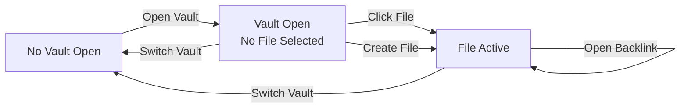

# Sitemap
flowchart TD

    
```
VAULT WORKSPACE
│
├── [STATE 1] No Vault Open
│   ├── Left Sidebar
│   │   └── Empty state  ("No Vault Open" + Open Vault button)
│   └── Main Area
│       └── Welcome Screen
│           └── [Action] Open Vault  ──────────────────────────► [STATE 2]
│
├── [STATE 2] Vault Open — No File Selected
│   ├── Left Sidebar
│   │   ├── Explorer Header
│   │   │   ├── New File button
│   │   │   ├── New Folder button
│   │   │   └── Refresh button
│   │   ├── File Tree
│   │   │   ├── Folder node
│   │   │   │   ├── [Expand / Collapse]
│   │   │   │   ├── [Context Menu]  ── New File / New Folder / Rename / Delete
│   │   │   │   └── [Drag & Drop target]
│   │   │   └── File node  (.md)
│   │   │       ├── [Click]  ─────────────────────────────────► [STATE 3]
│   │   │       ├── [Ctrl+Click]  ──────────────────────────── Open in new Tab
│   │   │       ├── [Context Menu]  ── Rename / Delete
│   │   │       └── [Drag & Drop source]
│   │   └── Vault Footer
│   │       ├── Vault Name
│   │       ├── Vault Path  ─── [Click] Switch Vault
│   │       └── (+) Switch Vault button
│   ├── Main Area
│   │   └── Empty editor placeholder
│   └── Right Panel
│       └── (empty — no active document)
│
└── [STATE 3] Vault Open — File Active
    ├── Title Bar  (Electron window controls)
    ├── Left Sidebar  (same as STATE 2)
    ├── Tabs Bar
    │   ├── Tab item  ── [Click] Switch Tab
    │   │              ── [X] Close Tab
    │   └── (multiple tabs)
    ├── Main Editor Area
    │   ├── Note Title  (editable input)
    │   ├── Properties Panel
    │   │   ├── Properties list
    │   │   │   ├── Text property
    │   │   │   ├── Date property
    │   │   │   ├── Checkbox property
    │   │   │   ├── Number property
    │   │   │   └── List property  (tag badges + autocomplete)
    │   │   │       └── Tag Suggestion Dropdown
    │   │   ├── [+ Add Property]  ── inline form: name + type selector
    │   │   └── [✕ Delete Property]  per property
    │   └── Block Editor
    │       ├── Heading block  (H1 / H2 / H3)
    │       ├── Paragraph block
    │       ├── List Item block  (bullet / checkbox)
    │       ├── Quote block
    │       ├── Code block  (with language)
    │       ├── Table block
    │       ├── Callout block
    │       └── Inline elements
    │           ├── [[Wikilink]]  ── [Click] ── resolve? ──► Open Note
    │           │                                         └► Confirm Create Note
    │           └── #hashtag    ── [Click] ──► Switch Sidebar to Search + Query SQLite Tag
    └── Right Panel
        ├── Tags section
        │   └── Tag badges  ── [Click] ──► Switch Sidebar to Search + Query SQLite Tag
        ├── Metadata section
        │   ├── Word count
        │   ├── Character count
        │   └── File path
        └── Backlinks section
            └── Backlink card  ── [Click] ──► Open source note
```

---

# Wireframes
## Wireframe
![[Pasted image 20260611173428.png]]

## Vault UI MockUp
## Screen 1 — No Vault Open

```
┌─────────────────────────────────────────────────────────────────────────────┐
│ ● ─ ▪   VAULT WORKSPACE                                                     │  ← Titlebar
├──────────────────────────┬────────────────────────────────────────────────  │
│                          │                                                   │
│                          │      Welcome to Your Vault                        │
│     ┌────────────────┐   │                                                   │
│     │                │   │  Select a folder or click "+" to open a           │
│     │   📂           │   │  different vault directory.              [Open ▶] │
│     │                │   │                                                   │
│     │  No Vault Open │   │                                                   │
│     │                │   │                                                   │
│     │  Open a folder │   │                                                   │
│     │  to use as     │   │                                                   │
│     │  workspace.    │   │                                                   │
│     │                │   │                                                   │
│     │  [Open Vault]  │   │                                                   │
│     │                │   │                                                   │
│     └────────────────┘   │                                                   │
│                          │                                                   │
└──────────────────────────┴────────────────────────────────────────────────  ┘
```

---

## Screen 2 — Vault Open, No File Selected

```
┌─────────────────────────────────────────────────────────────────────────────┐
│ ● ─ ▪   VAULT WORKSPACE                                                     │
├──────────────────────────┬──────────────────────────────────────────────────┤
│  EXPLORER          [↺]   │                                                   │
│  ┌────────────────────┐  │                                                   │
│  │ [📄 New File] │ [📁]│  │                                                   │
│  └────────────────────┘  │                                                   │
│                          │                                                   │
│  ▼ 📁 Projects           │   No note selected.                               │
│    ▶ 📁 Work             │                                                   │
│      📄 meeting.md       │   Select a note from the file explorer            │
│      📄 todo.md          │   on the left or create a new file                │
│  ▶ 📁 Personal          │   to start writing.                               │
│    📄 journal.md         │                                                   │
│    📄 ideas.md           │                                                   │
│                          │                                                   │
│                          │                                                   │
│                          │                                                   │
│                          │                                                   │
├──────────────────────────┤                                                   │
│  My Vault                │                                                   │
│  ~/Documents/vault   [+] │                                                   │
└──────────────────────────┴──────────────────────────────────────────────────┘
```

---

## Screen 3 — File Active (Full Layout)

```
┌──────────────────────────────────────────────────────────────────────────────────────────┐
│ ● ─ ▪   VAULT WORKSPACE                                                                   │
├──────────────────────────┬──────────────────────────────────────────┬────────────────────┤
│  EXPLORER          [↺]   │ [📄 meeting ×] [📄 todo ×] [📄 ideas ×]  │                    │
│  ┌────────────────────┐  ├──────────────────────────────────────────┤   PROPERTIES       │
│  │ [📄 New] │ [📁 New]│  │                                           │  ─────────────     │
│  └────────────────────┘  │  Meeting Notes                           │                    │
│                          │ ─────────────────────────────────────    │  TAGS              │
│  ▼ 📁 Projects           │                                           │  ┌──────────────┐ │
│    ▼ 📁 Work             │  ┌─────────────────────────────────────┐ │  │ #work  #team │ │
│   ►📄 meeting.md  ◀ active│  │ DATABASE  Note Properties     [+Add]│ │  └──────────────┘ │
│      📄 todo.md          │  │ ─────────────────────────────────── │ │                    │
│  ▶ 📁 Personal          │  │ date    │ 2026-06-11              [✕]│ │  METADATA          │
│    📄 journal.md         │  │ status  │ ○ in-progress           [✕]│ │  ┌──────────────┐ │
│    📄 ideas.md           │  │ tags    │ #work  #team  + add...  [✕]│ │  │ Words    142 │ │
│                          │  └─────────────────────────────────────┘ │  │ Chars    891 │ │
│                          │                                           │  │ Path  Work/  │ │
│                          │  #notes  #knowledge  |  Active Document   │  │  meeting.md  │ │
│                          │ ─────────────────────────────────────    │  └──────────────┘ │
│                          │                                           │                    │
│                          │  # Meeting Notes                          │  BACKLINKS         │
│                          │                                           │  ┌──────────────┐ │
│                          │  ## Agenda                                │  │ 📄 todo.md   │ │
│                          │  - Item 1                                 │  │  ...see [[   │ │
│                          │  - [x] Item 2 (done)                      │  │  meeting]]...│ │
│                          │  - [ ] Item 3                             │  └──────────────┘ │
│                          │                                           │  ┌──────────────┐ │
│                          │  ## Notes                                 │  │ 📄 ideas.md  │ │
│                          │  Discussed with [[John]] about the        │  │  ...based on │ │
│                          │  #roadmap for Q3.                         │  │  [[meeting]] │ │
│                          │                                           │  └──────────────┘ │
│                          │  ```typescript                            │                    │
│                          │  const x = 1;                             │                    │
│                          │  ```                                      │                    │
│                          │                                           │                    │
├──────────────────────────┤                                           │                    │
│  My Vault                │                                           │                    │
│  ~/Documents/vault   [+] │                                           │                    │
└──────────────────────────┴──────────────────────────────────────────┴────────────────────┘
```

---

## Wireframe — Context Menu

```
  ▼ 📁 Work
    📄 meeting.md  ◄─ right-click
    📄 todo.md
         │
         ▼
    ┌────────────────┐
    │  📄 New File   │
    │  📁 New Folder │
    │  ─────────────  │
    │  ✏️  Rename     │
    │  🗑️  Delete     │
    └────────────────┘
```

---

## Wireframe — Add Property Form

```
┌────────────────────────────────────────────────────────┐
│  DATABASE  Note Properties                      [+ Add] │
│  ─────────────────────────────────────────────────────  │
│  ┌─────────────────────────────────────────────────┐   │
│  │  Property name...  │ [Text ▾]  [Add]  [Cancel]  │   │  ← inline form
│  └─────────────────────────────────────────────────┘   │
│                          [Text]                         │
│                          [List (Tags/Aliases)]          │
│                          [Date]                         │
│                          [Checkbox]                     │
│                          [Number]                       │
└────────────────────────────────────────────────────────┘
```

---

## Wireframe — Tag Autocomplete Dropdown

```
│  tags  │  #work  #team  │  + add...   │
│                          └────────────────────┐
│                            #knowledge          │  ← filtered suggestions
│                            #roadmap            │     từ allVaultTags
│                            #project            │
│                          └────────────────────┘
```

---

## Wireframe — Toast Notifications

```
                              ┌──────────────────────────────┐
                              │  ✓  Created meeting.md    ×  │
                              └──────────────────────────────┘
                              ┌──────────────────────────────┐
                              │  ✓  Modified todo.md      ×  │
                              └──────────────────────────────┘
                                      (góc trên phải, z-50)
```

---

## Wireframe — Wikilink: Note Not Found

```
┌────────────────────────────────────────────────────┐
│  [Browser confirm dialog]                          │
│                                                    │
│  Note "John" does not exist.                       │
│  Do you want to create it?                         │
│                                                    │
│              [Cancel]          [OK]                │
└────────────────────────────────────────────────────┘
```